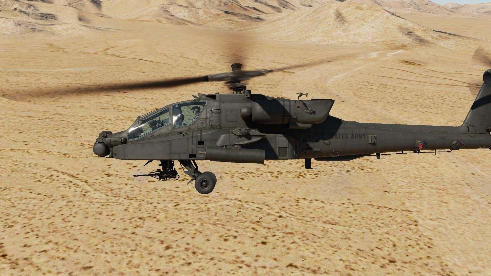
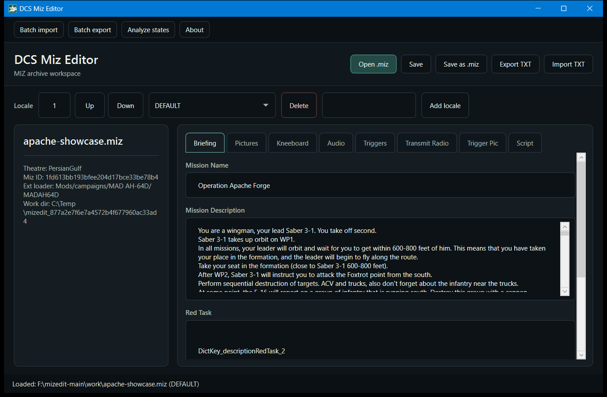
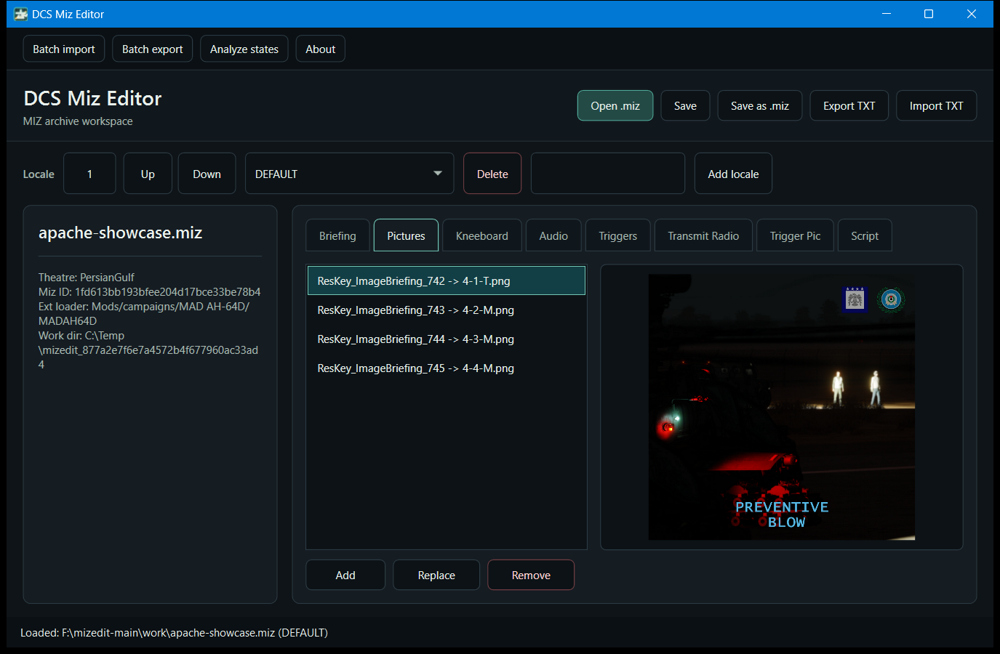
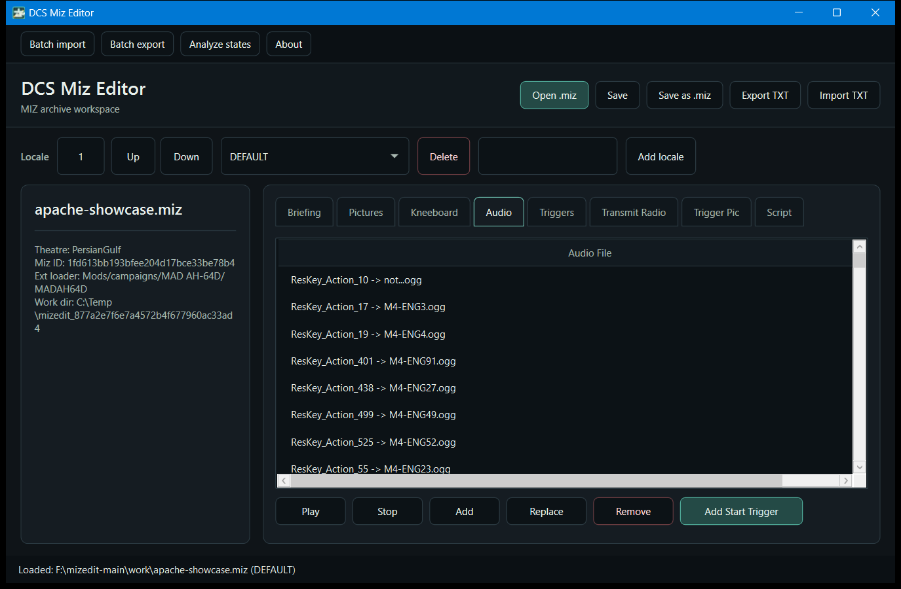
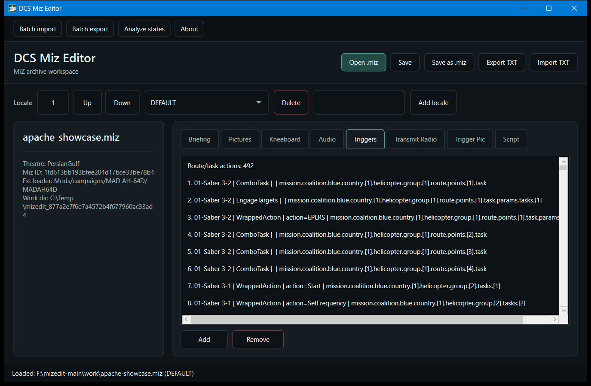
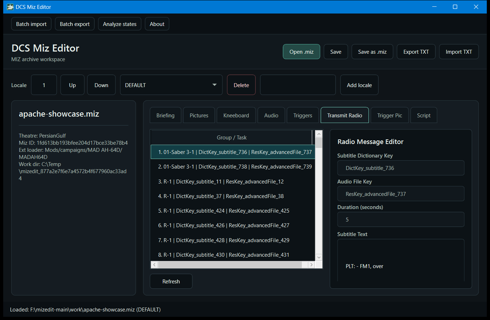

# DCS Miz Editor

<p align="center">
  
</p>

<p align="center">
  A Windows editor and translation workspace for DCS World <code>.miz</code> missions.
</p>

<p align="center">
  <a href="README.md"><strong>English</strong></a> ·
  <a href="README.ru.md">Русский</a> ·
  <a href="https://github.com/Mewt0/dcs-miz-editor/releases/latest"><strong>Download</strong></a>
</p>

MizEdit edits mission briefings, localization dictionaries, media resources, radio subtitles, scripts and selected mission structures without requiring manual ZIP/Lua work.

> [!IMPORTANT]
> For translation-only saves, MizEdit keeps the original `mission` file and `l10n/DEFAULT/*` byte-for-byte unchanged. New locale Lua files are written as UTF-8 without BOM, as required by DCS.

## Download

Download the ready-to-run Windows x64 archive from [GitHub Releases](https://github.com/Mewt0/dcs-miz-editor/releases/latest), extract it, and run `MizEdit.exe`.

Requirements: Windows 10/11 x64. The release is self-contained and does not require a separate .NET installation.

## Showcase

### Briefing and localization



Open `.miz` missions, switch between locales, edit briefing fields, and resolve `DictKey_*` values through `l10n/<locale>/dictionary`.

### Mission pictures



Add, replace, or remove briefing and trigger pictures while preserving `ResKey_*` references.

### Audio resources



Inspect localized audio, preview it, and replace files without changing the resource keys used by mission logic.

### Trigger and route-task scan



Inspect classic triggers and nested route/task actions such as `ComboTask`, `WrappedAction`, `TransmitMessage`, scripts, frequencies, and target actions.

### Radio subtitle editing



Edit `TransmitMessage` subtitles with group/task context, duration, dictionary keys, and linked audio resources.

## Translation workspace

- Numbered translator-friendly export without exposing backend `DictKey_*` values.
- Stable batch identity, legacy marker compatibility, and partial imports.
- Block-aware Smart Paste that preserves multiline responses.
- Deduplication of identical source strings.
- Mandatory preview for clipboard imports: changed, skipped, rejected, and missing rows.
- Missing row tracking, so an unchanged row in a 1,000-line batch remains visible.
- Optional AI translation queue using Gemini or Ollama-compatible providers.
- Checkpoints for interrupted translation jobs.

## Save and quality safety

Before saving, MizEdit can show:

- changed translation keys;
- archive files that will be added, replaced, or removed;
- placeholder, newline, frequency, coordinate, and length problems;
- untranslated text and inconsistent translations of duplicate originals;
- suspicious Lua/technical text changes.

Translation-only saves create or update a complete `l10n/RU/dictionary` with DEFAULT fallback values. They do not rewrite mission logic. Backups are created before replacing an existing `.miz`.

## DCS mission structure

A `.miz` file is a ZIP archive. Important entries include:

- `mission` — the main Lua mission table;
- `options`, `warehouses`, `theatre` — mission metadata;
- `l10n/<locale>/dictionary` — localized `DictKey_*` text;
- `l10n/<locale>/mapResource` — `ResKey_*` file mapping;
- `l10n/<locale>/*` — audio, images, scripts, and other resources;
- `KNEEBOARD/IMAGES/*` — kneeboard pages.

## Build from source

Requirements: Windows and .NET SDK 10.

```powershell
dotnet restore .\mizedit.csproj
dotnet build .\mizedit.csproj -c Release
dotnet run --project .\mizedit.csproj
```

Run the focused localization regression:

```powershell
dotnet run --project .\tests\GreenLine.Integration\GreenLine.Integration.csproj -c Release -- --briefing-locale-smoke
```

## Project status

MizEdit is under active development. Always keep the automatic backup until the edited mission has been tested in DCS.
